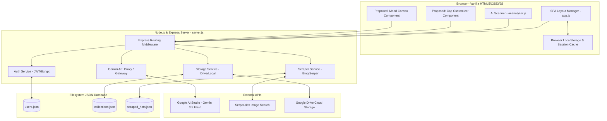
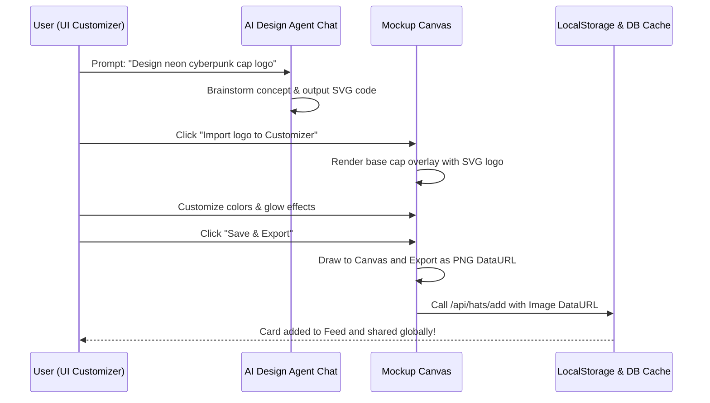

# CapInterest Premium Feature Proposals & Codebase Audit

This document summarizes a codebase audit of the **CapInterest** web application and presents 3 premium feature proposals aligned with the cyberpunk theme.

---

## 1. Codebase Audit & Architectural Summary

The CapInterest application is built on a split architecture combining a lightweight, file-based Node.js backend with an interactive Single Page Application (SPA) frontend. Below is an audit of the current software architecture:

### Frontend Architecture (Client-Side)
- **Vanilla SPA (`public/index.html`, `public/app.js`):** The application relies on vanilla ES6 JavaScript and HTML5 template elements. It maintains application states client-side (active tab, search queries, translation settings, authentication tokens).
- **Styling & Cyberpunk Aesthetic (`public/styles.css`):** Formatted entirely with CSS custom properties (variables) featuring high-contrast neon highlights (Cyber-Cyan `#00f0ff`, Tech-Pink `#ff007f`, Neo-Purple `#7f00ff`, and Emerald `#00ffcc`). Utilizes absolute styling, grid systems, custom responsive masonry layouts, and keyframe animations simulating glitch effects, pulsing glowing states, and glowing laser scanner lines.
- **AI Scanning Orchestration (`public/ai-analyzer.js`):** Controls scanner animation sequences, captures drag-and-drop file inputs, performs binary array reading, and interfaces directly with the backend proxy to output metrics like AI Trend Scores, fabric styling analysis, and outfit coordinates.
- **Bilingual Core:** Full Vietnamese (VI) and English (EN) translation dictionaries stored locally, binding interface assets based on standard HTML `data-i18n` attributes.

### Backend Architecture (Server-Side)
- **Node.js Express Server (`server.js`):** Serves static files and implements lightweight API routes.
- **Flat File Database (JSON DB):** Database persistence resides in local flat JSON files inside the `data/` directory:
  - `users.json`: Credentials, salts, and user-associated API Keys.
  - `collections.json`: User collections and liked hat lists.
  - `scraped_hats.json`: Search engine cache database storing aggregated pins.
  - `serper_usage.json`: Daily query counter checking credit limits.
- **Image Crawling Engine:** Combines Bing custom scrapers (targetting `.pinimg.com` patterns to locate real Pinterest Pins) and Serper.dev Google Custom Search Engine as a secondary API tier. 
- **Storage Layer (Drive & Local Fail-safe):** Automatically attempts upload to Google Drive using a Service Account IAM token. In case of API failure or missing keys, it cleanly falls back to writing local buffers under `/public/uploads`.
- **AI Integration Gateway:** Integrates directly with **Google AI Studio (Gemini 3.5 Flash)** to analyze custom uploads and drive chatbot logic. Uses client-provided keys or environment configuration fallback.

---

## 2. Premium Cyberpunk Feature Proposals

Here are three high-level premium feature proposals designed to enhance user experience, expand web capabilities, and align with the cyberpunk theme.

### Proposal A: 2D Cyberpunk Cap Mockup Customizer (Cyber-Tailor)
**Concept:** An interactive customizer panel allowing users to visual-design their own caps.
- **Features:** 
  - Choose cap base style (Beanie, Dad Hat, Snapback, Bucket Hat) via an interactive blueprint wireframe.
  - Apply custom color palettes (Neon gradients, dark-techware carbon fibers, matte black, holographic vinyl).
  - Add cyber decal overlays (glitch stripes, barcodes, warnings, circuit traces).
  - Import the custom SVG logos dynamically designed by the **AI Design Agent** in the chat console.
- **Cyberpunk Aesthetic:** Cybernetic overlay UI, grid guides, blueprint aesthetics, glitch-text input field, and reflective neon rendering.

### Proposal B: Interactive Visual Design Canvas (Cybernetic Mood Board)
**Concept:** A spatial canvas board allowing users to lay out, link, and analyze their favorite hat combinations.
- **Features:**
  - Drag-and-drop saved caps from their collections list onto an infinite grid canvas.
  - Draw circuit trace connections (linking lines) between caps to map out stylistic links.
  - Pin digital notes (sticky warnings), color swatches, and design annotations.
  - "AI Cluster Analyze": Select a group of connected nodes and submit it to the AI Design Agent to generate a unified styling report or prompt a composite cap creation.
- **Cyberpunk Aesthetic:** System terminal grid, neon laser-drawn connector lines, terminal logging overlay, and a dark digital workbench theme.

### Proposal C: Arcade Hype Feed & Global Leaderboard
**Concept:** A community voting showcase ranking customizer cap models.
- **Features:**
  - Submit designed caps to a shared "Hype Feed".
  - Community upvoting styled as "Injecting Hype" (generating a flashing neon score change).
  - "Hype Leaderboard" showing the highest-rated digital cyber-caps and their creators.
  - Click any card in the feed to clone the customizer configuration back into your own studio.
- **Cyberpunk Aesthetic:** Low-fi arcade console aesthetic, flashing neon banners, scrolling pixel text showing leaderboard leaders, and custom neon rank badges (e.g., *Cyber-Tailor Level 10*, *Street-Net Runner*).

---

## 3. Technical Feasibility & Constraints Audit

To satisfy codebase requirements, all features must be implemented **purely on the frontend** without modifying database schemas or backend server code.

### Feasibility Matrix

| Feature | UX Impact | Front-End Implementation Detail | Backend Modifications | Risk Level | Aesthetic Alignment |
| :--- | :--- | :--- | :--- | :--- | :--- |
| **A. Cap Customizer** | **Critical** | HTML5 Canvas drawing, CSS mask-images, and SVG filters to overlay logo decals and color hues onto transparent product base assets. | **None** (Exports final design to PNG DataURL, using existing `/api/hats/add` to store/share). | Low | Excellent (Custom neon patterns and decal placement). |
| **B. Visual Mood Canvas** | **High** | Mouse coordinate mapping, CSS Grid/Translate positioning, and dynamic SVG `line` elements drawing connector links. | **None** (Serialized into a configuration JSON string saved in the existing Settings profile database). | Medium | Excellent (Hacker terminal node map layout). |
| **C. Community Showcase** | **Medium-High**| Masonry grid template filtering by special custom tags (e.g. `custom-design`) with upvotes mapped onto existing collection "likes". | **None** (Upvote score calculated client-side by counting standard likes across user DB entries). | Low | High (Gamified leaderboards). |

### Cap Customizer Integration Flow

---

## 4. Implementation Path (Frontend Execution)
1. **Mockup Assets:** Create transparent, high-contrast base cap images (snapback, dad hat, bucket, beanie) placed inside `public/assets/`.
2. **Customizer View:** Add a dynamic canvas UI containing sliders for color channels (HUE/Saturation), pattern presets, and image file uploaders.
3. **SVG Importing Layer:** Enable the chat screen's custom SVG blocks to register a click listener that extracts the raw SVG code and draws it onto the canvas mockup layer.
4. **Export Handler:** Implement the `Canvas.toDataURL('image/png')` exporter to send the resulting image to the backend's `/api/hats/add` route, creating a shared community creation without schema changes.

---

> [!IMPORTANT]
> **Feedback Request:** Please review these premium feature proposals. Let me know which proposal (A, B, or C) you would like to prioritize, and what refinements or specific requirements you'd like to add!
